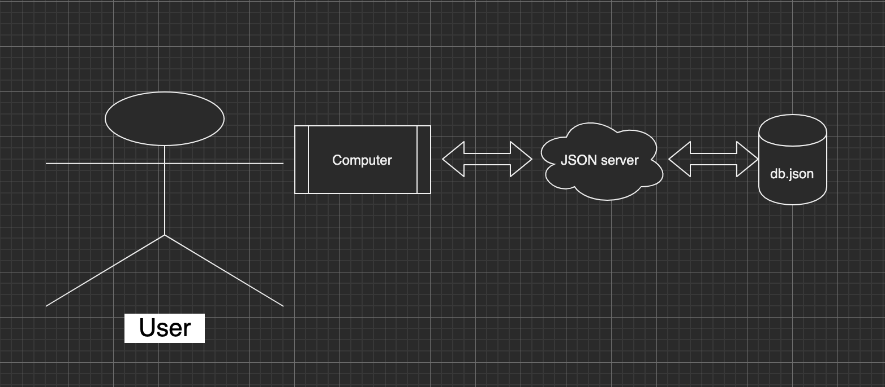
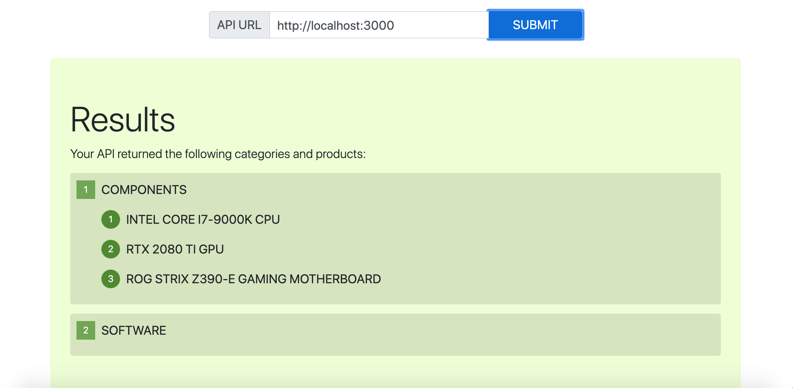

# Lab 06

## Server

### Author: Clayton Jones

### Links and Resources

- [submission PR](https://github.com/claytonjones-401n16/lab-06/pull/1)
- [Swagger Documentaion](https://app.swaggerhub.com/apis/clayton-jones/lab06/0.1)

### Setup

#### How to initialize/run server
- clone repo
- `npm i -g json-server` (if you don't have json-server already)
- in terminal from inside root directory: `json-server --watch ./data/db.json`

#### UML

#### Passing React Application

